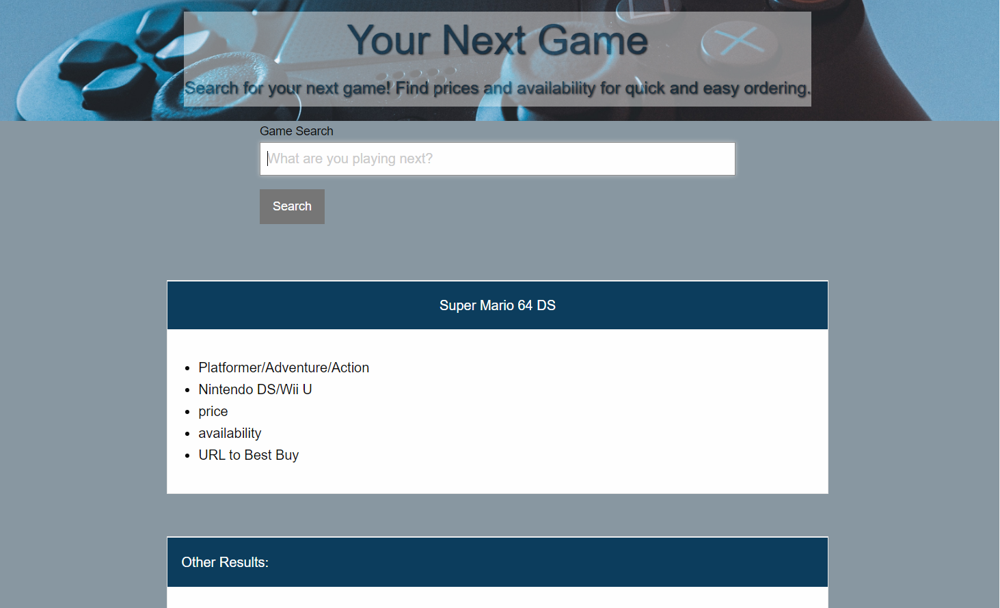

# Your Next Game

📖Your Next Game by The Soaring Eagles: 
Rikayla Johnson, Jacob Brister, Samantha Karpovck
Implemented the following user story:

## Description
This project allows you to search a game and see relevant information such as genre, game systems that it is available for, and see reviews, and ratings. You also have similar games listed that you may also be interested in. 

## User Story

AS A gamer
I WANT to search for games
SO THAT I can see ratings and reviews

GIVEN a search box
WHEN I search for a game
THEN I am presented with the name, description,genre, reviews, and ratings 
WHEN I search for a game
THEN the information I want is presented and my recent searches are shown at the bottom
WHEN I view a game
THEN I am presented with games that I may also be interested in
SO THAT I can see a description and rating of the game. 

## Acceptance Criteria
GIVEN a search box
WHEN I search for a game
THEN I am presented with the name, description and rating.  
WHEN I search for a game
THEN the information I want is presented and my 3 recent searches are shown at the bottom
WHEN I view a game
THEN I am presented with games that I may also be interested in

## About the site

You have a search bar to enter the name of a game. When you search for a game you are presented with your search result which includes (game name, genre, description, ratings, and reviews.). You also have up to four suggested games that you may also like. If you click on a suggested game you are shown the information for that game. 

You have a search bar to enter the name of a game. You are presented with Your search result which includes (game name, genre, description and rating). You also have two suggested games that you may also like.

## Assets

The URL is: https://samkarp700.github.io/product-project/

Repository located at: https://github.com/samkarp700/product-project
